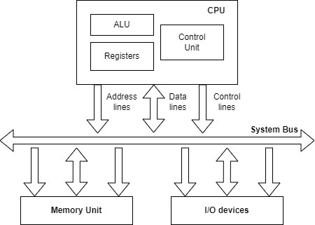
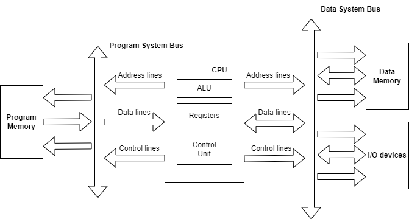

# Princeton and Harward architectures

At nowadays there are two different computer architectures:
1. Princeton (Von Neuman) architecture - the commands and data are stored in a common memory.
2. Harward architecture - there are separate memory storage for code and data.

## Princeton (Von Neuman) architecture
A computer architecture that uses a single memory unit within which both data and instructions get stored. 
The CPU executes instructions by fetching them from memory, decoding and then executing them. 
The figure below shows the architectural representation of the Princeton model.

There are four major components that constitute this architecture:
1. **CPU**: The central processing unit is composed of the control unit, arithmetic and logic unit, and registers. 
The control unit is responsible for generating control signals based on the order of executing the instructions. This means 
that the control signals are provided to the various components within the architecture for the proper flow of information. 
The ALU is responsible for executing the mathematical operations. While the registers are responsible for temporarily storing data and instructions.
2. **Memory**: The memory holds both instructions and data that the CPU needs to execute. The memory is organized as a linear sequence of addressable cells, 
each containing a fixed number of bits. A computer’s memory is mainly classified as RAM and ROM. RAM is the temporarily storage unit that stores data along 
with general-purpose instructions. While ROM is a permanent type of memory that holds the instructions responsible for booting up the system.
3. **Input/Output devices**: These devices are used to communicate with the outside world.
4. **System bus**: The system bus is a collection of wires that connect the CPU, memory and I/O devices. It is used to transmit data, instructions 
and control signals between these components.

## Harward architecture
A computer architecture where the memory unit is dvided into two parts for individually storing data and instruction. 
The figure below shows architectural representation of the Harward model.

There are five major components that constitute this architecture:
1. **CPU**: The role of the central processing unit is almost the same as for the Princeton architecture. The difference is that the control unit has 
separate modules to generate addresses to fetch instructions from the program memory and access the data memory.
2. **Instruction memory**: This memory holds instructions that the CPU needs to execute. It is typically implemented as read-only memory (ROM) or flash memory.
3. **Data memory**: This memory holds data that the CPU needs to perform computations. It is usually random access memory (RAM).
4. **Input/Output devices**: These devices are used to communicate with outside world.
5. **System buses**: To simplify things, there are two of them - to transfer data between data memory or I/O devices and CPU and to fetch data from program memory. 
The system bus is a collection of wires that connect the CPU, instruction memory, data memory and I/O devices.

###### Historical note:
The differences in computer architectures came from the early days of electronic computing. Many years ago the United States government 
asked Harward and Princeton Universities to come up with a computer architecture to be used in computing tables of Naval artillery shell 
distances for varying elevations and environmental conditions. Princeton’s response was a computer that had common memory for storing 
the control program as well as variables and other data structures. It was best known by the chief scientist’s name “Von Neuman”. 
In contrast, Harward’s response was a design that used separate memory banks for program store, the processsor stack and variable RAM. 
The Princeton architecture won the competition because it was better suited for the technology of the time. Using one memory was preferrable 
because of the unreliability of current electronics (this was before transistors were in widespread use). A single memory interface would 
have fewer things that could go wrong. The Harward architecture was largely ignored until the late 1970s when microcontroller manufactures 
realized that the architecture had advantages for the devices they were currently designed.

#### The Von Neuman principles
The basic principles of Von Neuman architecture were first formulated in 1945. In the original papers these principles are not formulated clearly, 
but in modern interpretation, they sound as follows:
1. *The principle of binary coding.* According to this principle, all information entering to the computer encoded using binary signals.
2. *The principle of programmed control.* It follows that the program consist of a set of commands that are run by the processor automatically after 
another in a certain sequence.
3. *The principle of memory homogeneity.* Programs and data are stored in the same memory. Therefore, the computer does not distinguish what is stored 
in a given memory cell - a number, a text or a command. You can perform the same actions on commands as on data.
4. *The principle of addressness.* Structurally the main memory consists of numbered cells: any cell is available to the processor at any time. Hence 
follows, it is possible to give names to memory areas, so that the values stored in them could be subsequently accessed or changed during program 
execution using the assigned names. 
