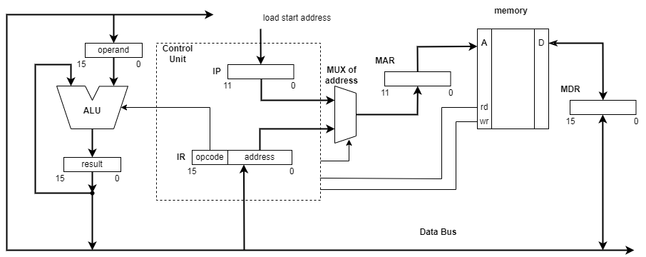

## Structure and operation of a simple computer

The control unit generates control signals to read and write memory. The code of the current command is located in the instruction register (IR). 
The command is kept in IR during all executing time. The command consist of:
1. Operation code 
2. Address of operand(s)
3. Address of the result

**Central Processing Unit (CPU)** consist of:
*Control Unit* receives instruction from the Memory Unit and decode that instruction into specific commands for other components of CPU. 
It directs the data flow and operation of the ALU.
*Arithmetical and Logical Unit (ALU)* does all arithmetical and logical operations. 
*Registers* are small and very fast storages inside the CPU. They are used to store operands and intermediate results of instruction execution.

## Instruction cycle

The execution of command is a complex action which consist of a few stages (phases):
- Instruction Fetch (IF)
- Instruction Decode (ID)
- Operand Fetch (OF)
- Execute (EX)
- Write Back (WB)

The fetch phase is reading a command from memory at the address currently stored in the instruction pointer (IP) register and transferring that command into the instruction register (IR). 
At the next phase the control unit decodes the command, extracts the operation code and addresses of operands (if needed) from it. When needed the operands are read from the memory into 
the registers on the next stage (fetch operands). The next phase is execution, depending on the operation the result is put into result register or current value of program counter is changed. 
Some arithmetical operations change bits in the flags register. If the command produces any result the next phase (write back) writes it into memory (write result register content into memory).

The instruction set of microprocessor can be divided into classes of commands:
- data transfer
- arithmetical and logical
- control transfer

The *data transfer* commands assume transferring data from memory cell into register or vise versa. The memory address and the register identifier (a number) is contained in the command itself.
The *arithmetical and logical* commands when executing fetch the operand(s) from the memory into the operand register and then ALU executes operation with that register(s). The result is put 
into the result register and then stored in the memory. The operation code, the address of operand and the address of result are in the current instruction. 
The *control transfer* commands:
- the unconditional jump command directs the control flow to the specified address. It copies the target address into the instruction pointer (IP) register.
- the conditional jump command directs the control flow to the specified address only when one of the condition is met. Depending on the state of the flags register it make a jump to the specified 
address or to the next command.
- the call of subprogram is similar to unconditional jump. It directs the control flow to the specifed address, but the addres of the next command is kept into the special memory area - stack.
- the command of returning from subprogram extracts from stack the address of the instruction followed after the subprogram call command and writes it into the instruction pointer (IP) register.
