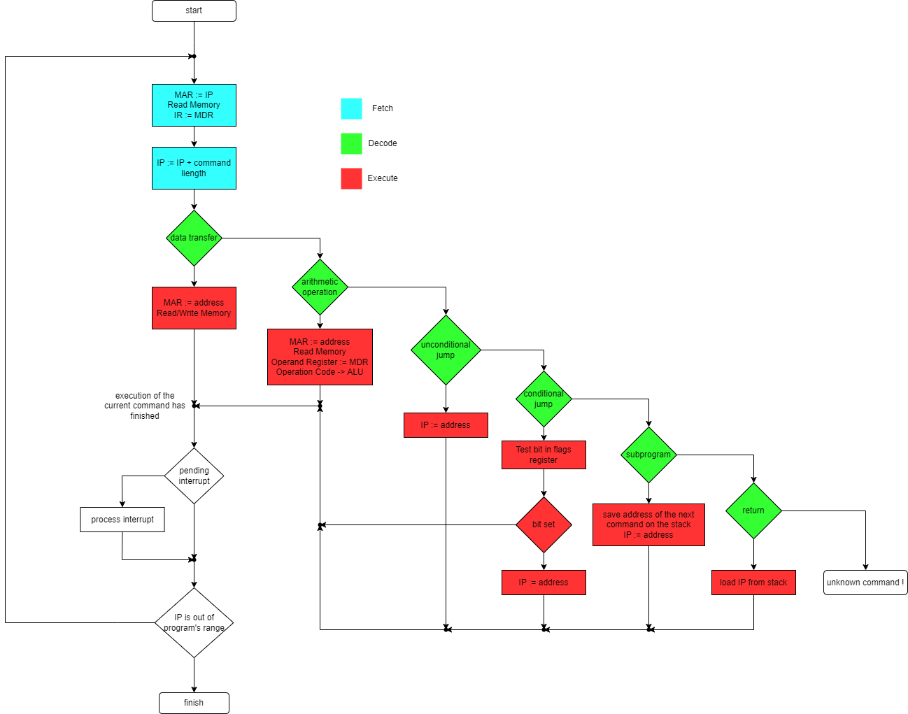

## Structure and operation of a simple computer

**Control Unit** fetch instructions to execute from memory. It generates control signals to read memory, increment address of instruction to read, switch input of address multiplexer (Multiplexer 
is a device that select one of its input and connect it to the output). The address of instruction to read is held in the IP (Instruction Pointer) it often named PC (Program Counter). Instruction 
addressed by IP is transfered from memory to IR (Instruction Register) where it stay till execution finished. When instruction is written into IR the Control Unit decode and execute it. Depending 
on the type of instruction it might be needed to read operand from memory and put it into register, write result of execution into memory, change order of program execution (call subprogram or 
branching). Instruction contains all information needed to it execute, in simplified form these are:
1. Operation code (bits 15 - 12) encodes which command to execute.
2. Flag (bit 11) of data transfer direction: either transfer from memory to register or vise versa.
3. Address (bits 10 - 0) of the operand (address of result, address of the subprogram).

**ALU (Arithmetical Logical Unit)** as it follow from it's name do arithmetical and logical operations. One of the operand is in the operand register, another one - in the accumulator register. 
The result is put into accumulator register (or result register). In some cases (result overflow, negative number, zero) ALU not only put result in the accumulator register but also set 
corresponding bit in the register of flags (not shown in the picture). These flags may be needed to the next instruction.

**Memory** stores program code to execute and data needed for program execution.

**Data Bus** transfers data between memory to CPU's registers. Data is tranferred by blocks of fixed width.

## Instruction cycle

No matter which architecture (Harward or Princeton) computer is based on, it follows the same order when executing program: fetch instruction in binary form from memory, decode and execute it. 
This process is known as fetch-decode-execute cycle or just instruction cycle. The cycle is repeated untill the end of the program. 
- The *Fetch* phase is reading instruction from memory at the address in the IP and writing it into the IR. The contents of IP is copied into MAR which is connected to the address bus, after 
that the control unit generates a signal to read memory to allow the contents of the memory location. The instruction stored at that address is latched in the MDR and transferred into the IR 
using data bus. This ensures that the MDR can be used during the execution phase. The content of the IP is incremented by the length of the instruction so that the point to the address of the 
next instruction.
- At the *Decode* phase the control unit split the instruction into opcode and operand to determine what type of instruction needs to be carried out. If the operand is memory location the 
control unit reads that location and latch it's content in the MDR. The usage of the operand depends on type of the instruction.
- The sequence of actions at the *Execution* phase depends on the type of instruction to be executed. The control unit sends signals to the relevant components so that the instruction is carried out.

All instructtions executed by the CPU could be divided (simplified) into the categories:
- data transfer
- arithmetical and logical
- control transfer

The *data transfer* commands assume transferring data from memory location into register or vise versa. The operand of instruction contains address of memory location to read/write. 
The *arithmetical and logical* commands assume reading of the operand into the register (operand register) from the memory location specified by instruction's operand, the execution of the operation 
and writing the result of operation from register (result register) into memory. The result is written to the same location as the operand. The operation encoded by opcode is executed by ALU, one of 
the operands is located in the accumulator another one in the operand register. The result of operation is put into the accumulator (result register).
The *control transfer* commands:
- the unconditional jump command directs the control flow to the specified address. It copies the address of the next instruction from the operand part of the command into the instruction pointer 
(IP) register.
- the conditional jump commands direct the control flow to the specified address only when specified condition is met. Depending on the result of arithmetical operation  ALU may set some bits in 
flags register (ZF, CF, SF, OF). Each of conditional operation check "its" bit and either make transfer of the control flow to the address specified by the command or don't change the control flow 
when flag is not set. To change the control flow the conditional operation copies address of the next instructiion into the IP register.
- the call of subprogram is similar to unconditional jump. It directs the control flow to the specifed address, but unlike the jump command it have to keep the address of the next instruction 
to resume the main control flow when returning from subprogram. The address of the next instruction is kept on the stack - special memory area dedicated to implement subprogram invocation.
- the command of returning from subprogram extracts from stack the address of the instruction followed after the subprogram call command and writes it into the instruction pointer (IP) register.

At the end of a cycle for each instruction, processor check if some interrupt request (IRQ) is awaiting to processing. When pending interrupt request is detected processor save current state on the 
stack and transfers control to the interupt service routine (ISR). When interrupt processing is finished processor resume the control flow of the interrupted program.