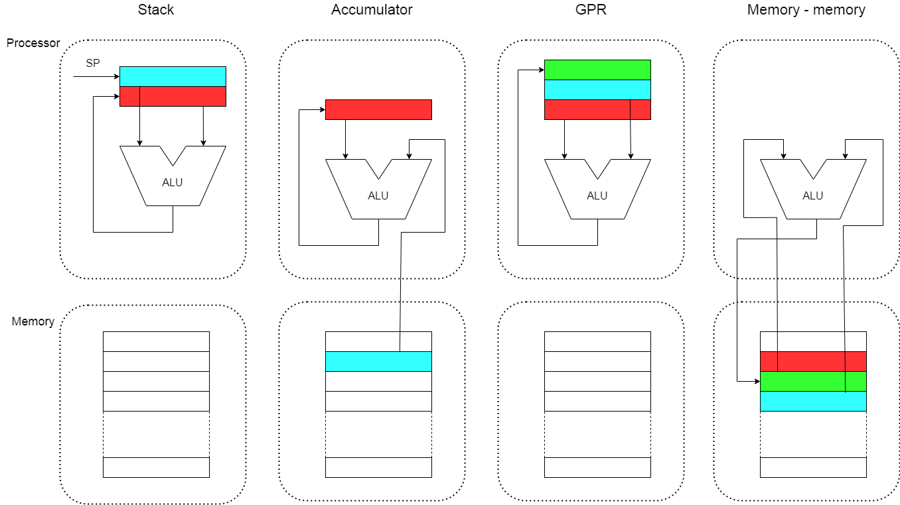
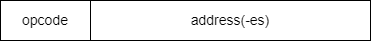
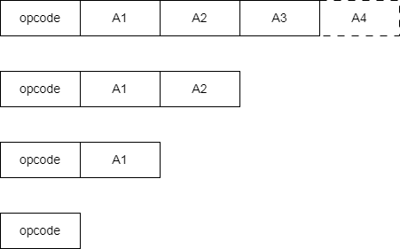
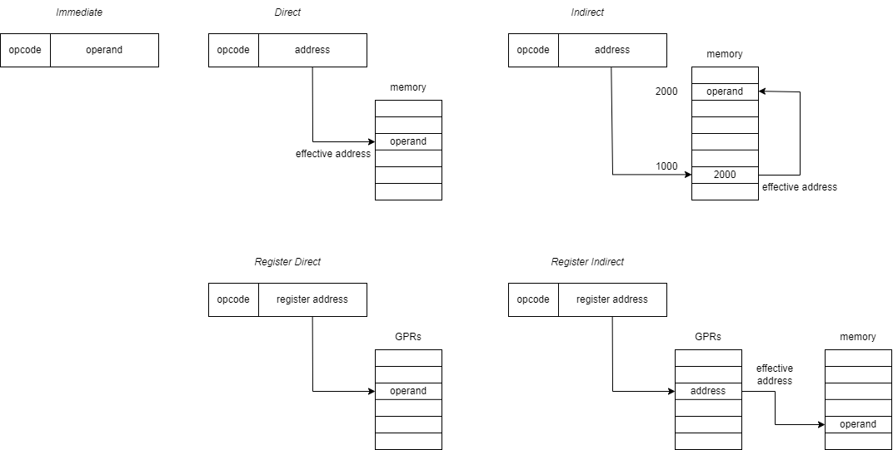
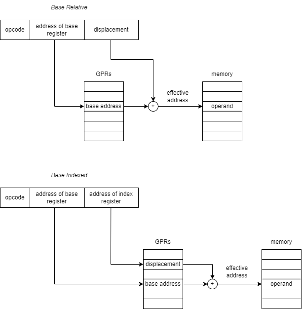
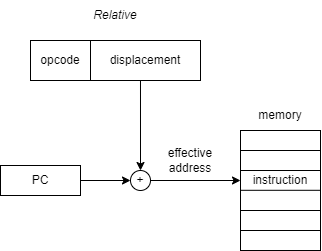

# Instruction Set Architecture

*Instruction Set Architecture* (ISA) is the part of the processor that is visible to programmer or compiler writer. It consider such design concepts as:
1. Data Storage 
- where to store operands so that computation can be performed
- where to store the computation result aftewards
2. Instruction Format describe encoding the instruction 
- the length of instruction
- instruction fields
- type and size of operands
3. Memory addressing modes

#### Classification of ISA by the data storage
1. Accumulator architecture - one operand is implicitly the accumulator, result is stored in accumulator.
2. Stack architecture - the operands are implicitly on the top of the stack, result is put on the top of the stack.
3. General Purpose Register (GPR) architecture - all operands (and result) are explicit: either register or memory location. There are two varieties of this architecture:
- register-memory architecture - one operand in memory
- register-register architecture - all operands in registers, also called load-store architecture
4. Memory-memory architecture - all operands in memory.

For example the expression written by programmer as `C = A + B` assumes that CPU add contents of two memory locations where variables `A`, `B` stored ant put the result in location `C`.

| **Stack** | ** Accumulator** |    **GPR**    | **GPR (load-store)** | **Memory-memory** |
------------------------------------------------------------------------------------------
|  push A   |  load A          |  load R1, A   |  load R1, A          |  add C, A, B      |
|  push B   |  add B           |  add R1, B    |  load R2, B          |                   |
|  add      |  store C         |  store R1, C  |  add R3, R2, R1      |                   |
|  pop C    |                  |               |  store R3, C         |                   |
|-----------------------------------------------------------------------------------------|

The most common storage design for modern processor is the general-purpose register (GPR). This includes many of the RISC processors (e.g. MIPS and ARM processor) which 
typically use register-register (i.e. load-store) architecture. On the other hand, CISC processors (e.g. IA32) use a mixture of register-register and register-memory architecture.

#### Instruction format
Essentially an instruction consits of minimum two components: instruction code (opcode) and address(-es) of operand(s) for the instruction 

Depending on instruction type it could comprise 1, 2, 3 or 4 addresses. 

Encoding of instruction is called *instruction format*. There are two generic ways to encode instructions:
1. Fixed length insstruction format
- allow for easy fetch and decode
- simplify pipelining and parralelism
- instruction bits are scarse
2. Variable length instruction format
- require multi-step fetch and decode
- allow for more flexible (but complex) and compact instruction set

#### Memory addressing modes
Addressing modes of an ISA specifies how to calculate the effective address of the operand(s) from the instruction. Addressing mode is encoded in the instruction. Outcome of Addressinf mode 
is the Effective Address (EA). *Effective address* is the address of the operand which is obtained by applicable calculations of the addressing mode specified in the instruction. Effective 
address reveals the location of the operand.
1. Immediate addressing - the operand contained in the command.
2. Direct addressing - the address field of instruction contains effective address of the operand.
3. Indirect addressing the address field of instruction contains either address of memory cell where effective address stored or address of GPR which contains effective address of operand.
4. Base Relative addressing applied when memory space is divided onto segments of a fixed length. The address part of instruction is of two fields, one contains address of register where 
start of memory segment is stored and another field contains the displacement in that segment.
5. Base Indexed addressing is variety of base relative addressing, the address part of the command contains addresses of base register and index register. The base register contains start 
of the segment in memory and index register contains displacement in that segment.
6. Relative addressing generally used in jump operations, the address field of instruction contains the displacement of the next command relative to the current program counter.

